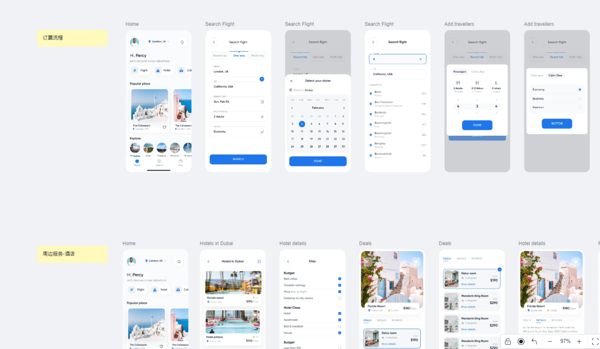
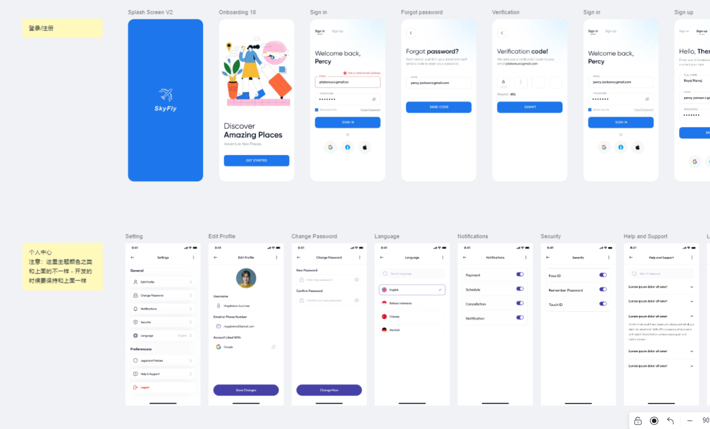
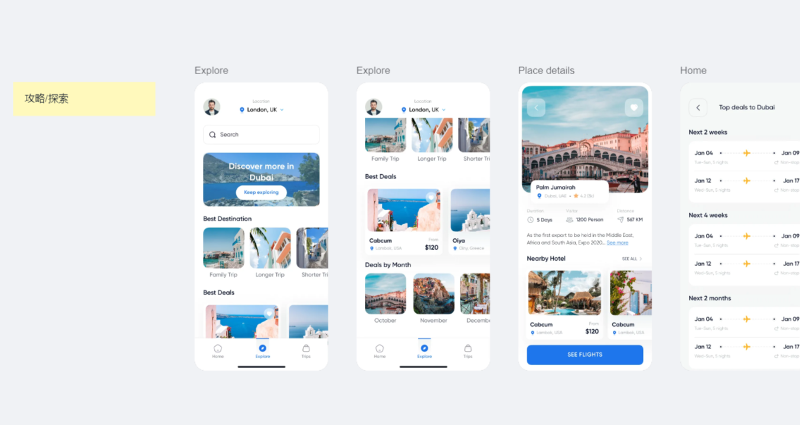

### IWIP航班APP

##### 项目开发计划

设计稿：https://lanhuapp.com/link/#/invite?sid=lX0lkxzL  

仓库：http://172.90.1.1/xiebaozhong/iwip-flight-booking-app（项目架构迟点搭建完成再发出来，并会把目录结构说明 写在README里面）；

Iconfont：https://fonts.google.com/icons?selected=Material+Icons:open_in_new:&icon.platform=flutter（官网地址）

技术实现思路：

+ 首先使用当前全球互联网app热门的技术栈：flutter、dart；
+ 使用原因：flutter目前相对来说比较成熟，无论是国内或国外都有很多公司使用其开发高性能app；flutter不仅提供了丰富的组件，而且生态已经很好了，遇到什么问题基本都可以找到解决方案；
+ 思路：使用官网提供的组件方式开发基础功能；并且参考市场各种封装好的优化功能。

##### 项目结构

+ 主要文件

```

./lib
├── main.dart
├── config # 相关公共配置
├── http
│   └── request.dart # 请求接口封装
│   └── api # 接口api文件目录
├── model # 数据模型 用于转换接口数据 用于方便视图调用（可以不转）
├── pages
│   ├── tabs tabbar底部切换页面
|   ├── ,,, 根据自己的页面创建文件夹/文件
├── style
│   ├── style.dart # 全局文字大小与颜色
│   └── text.dart # 主要的几个文字样式
└── provider # 全局状态管理工具
└── routers # 路由
└── utils # 公共方法类
│   └── ScreenAdapter.dart # 比例适配方法
│   └── ScreenAdapter.dart # 比例适配方法
```


##### 分工

开发人员：谢宝中、田海朋；

分工：

+ 谢宝中 - （订票流程和周边服务）

  


+ 田海朋 - （登录和注册）

  


+ （周边服务）其他页面暂定
  


时间： 暂无具体开发功能时间；开发周期大概2 - 3个月，测试和数据联调另外估时；

